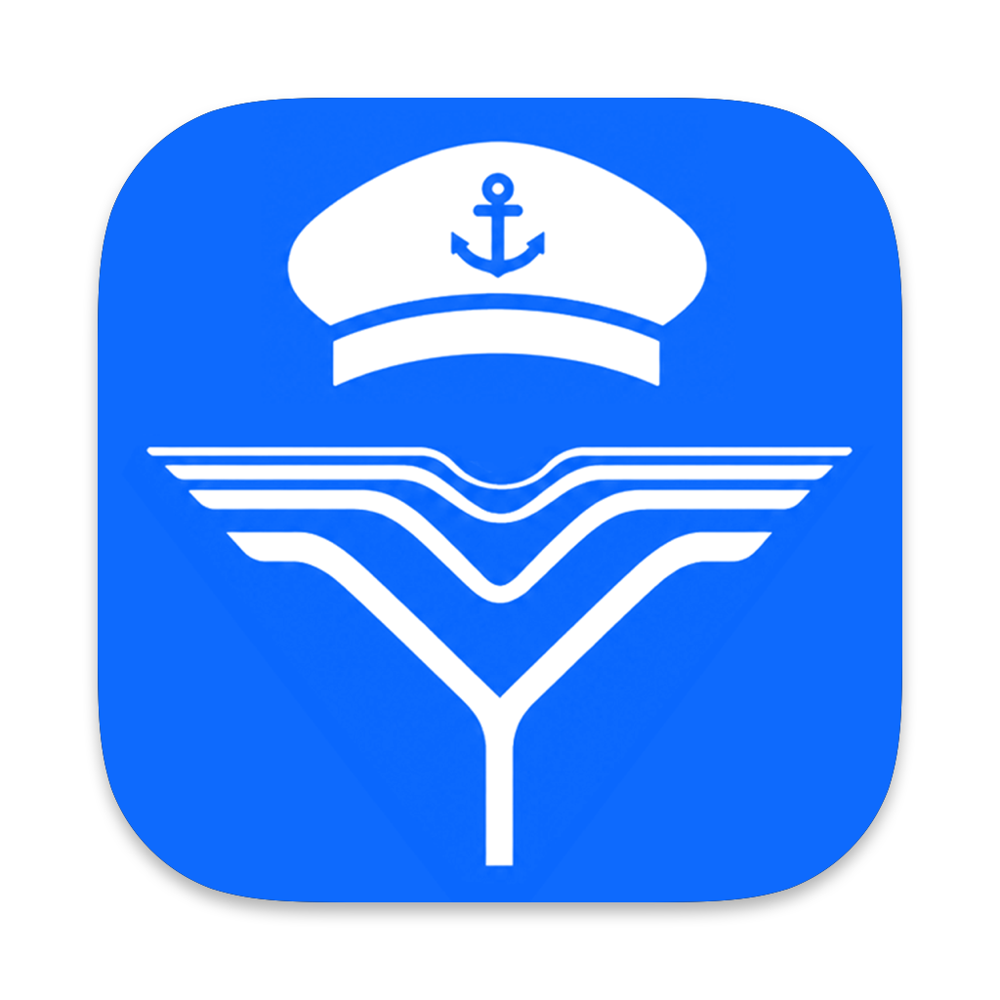
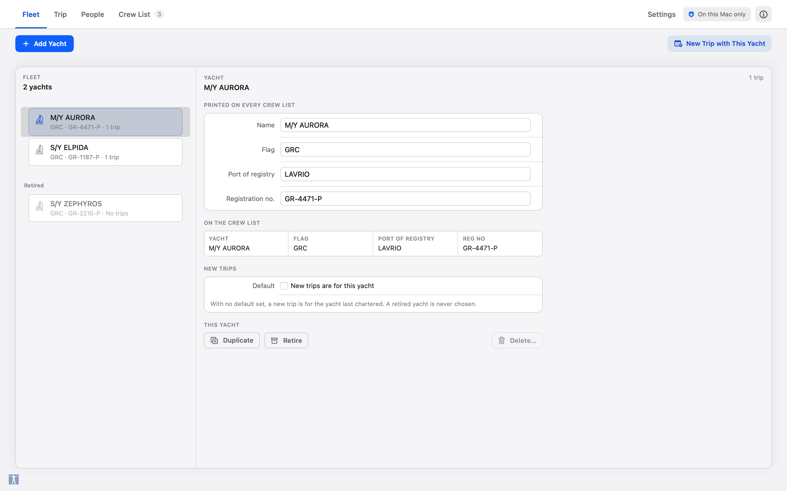
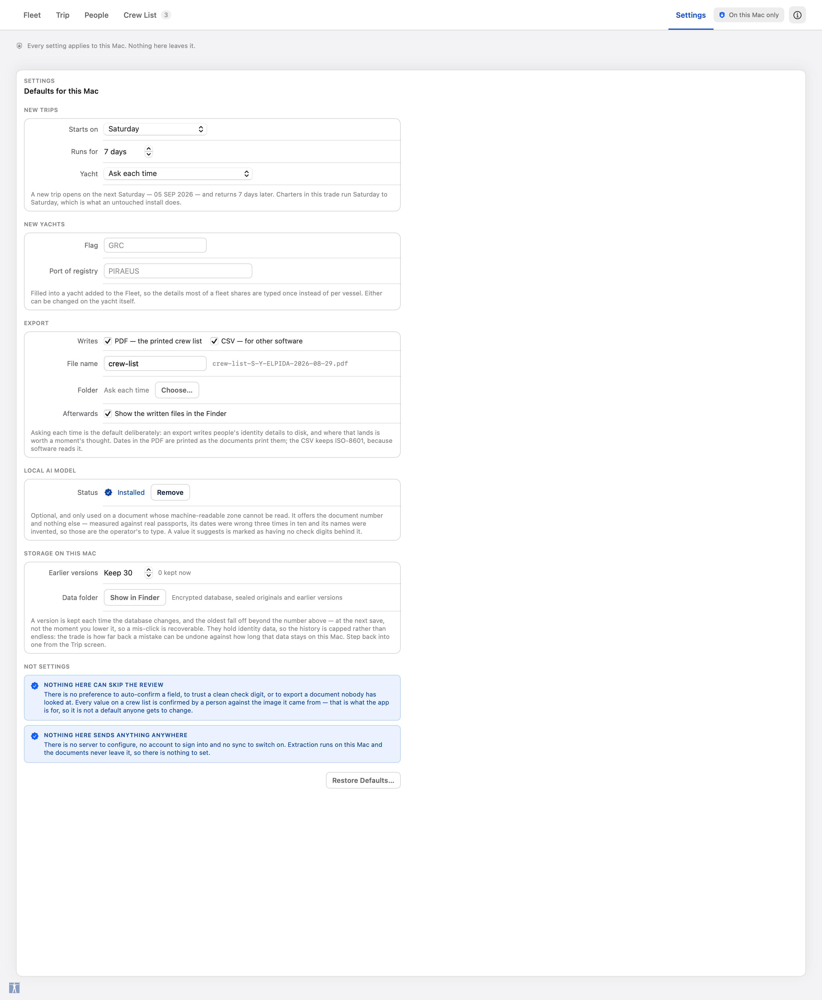
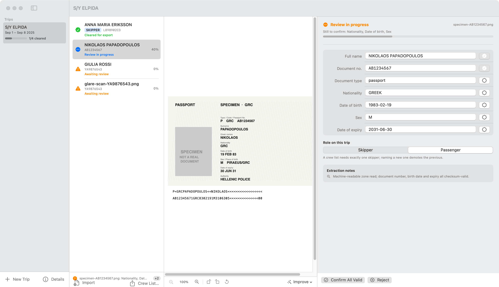
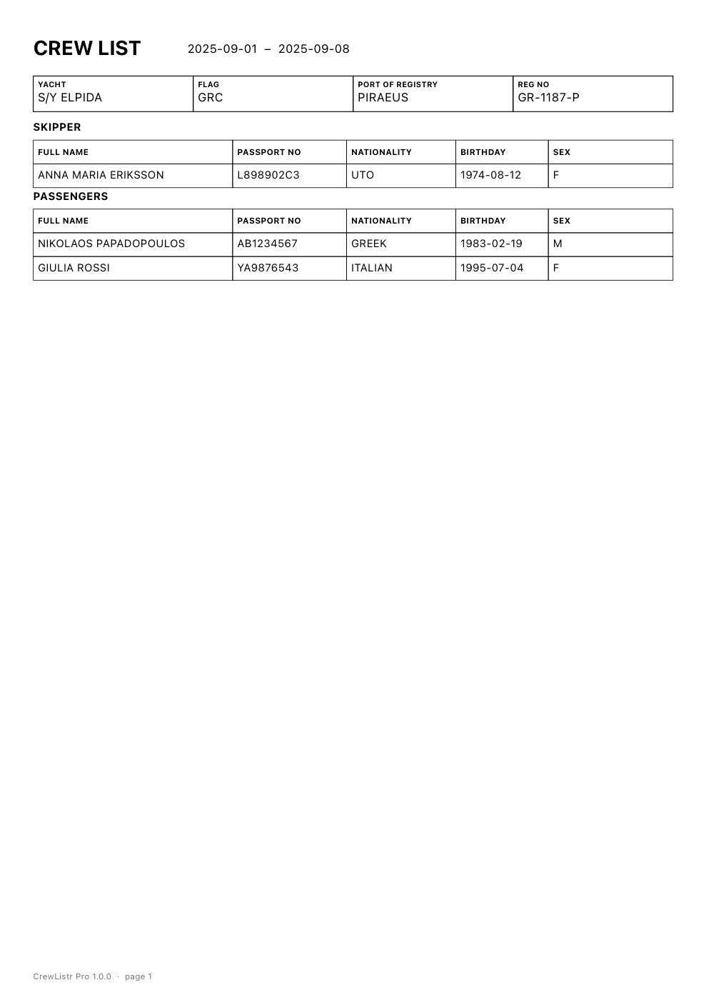
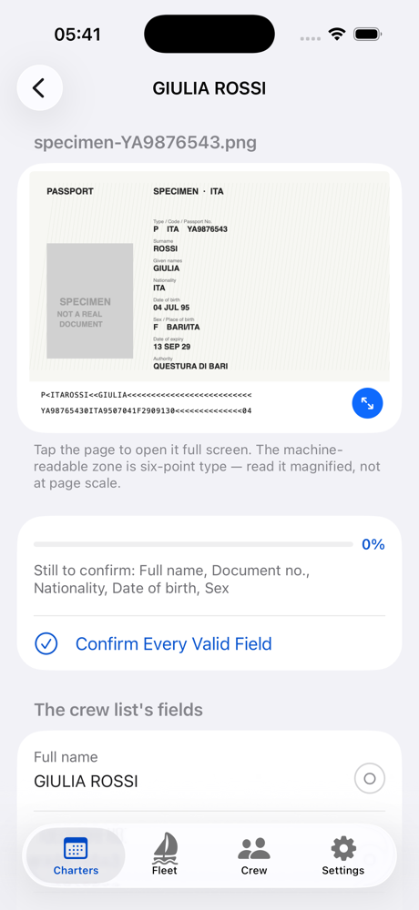
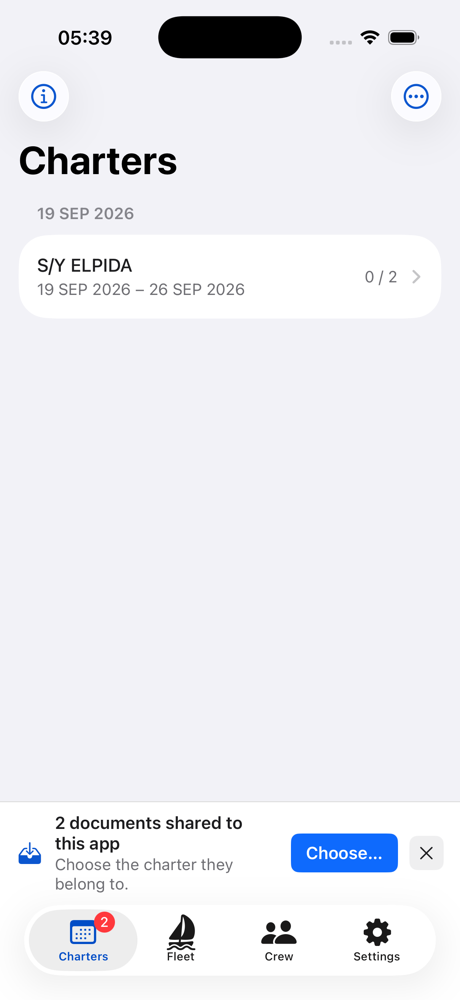

# CrewListr Pro



**Offline crew-list preparation for charter yachts.** Version 0.5.0 · macOS 15+ (Apple Silicon) · iOS 17+

CrewListr Pro turns photographed or scanned identity documents into the crew list a port
authority expects. Extraction runs entirely on the device using Vision OCR and ICAO 9303
machine-readable-zone parsing, with an optional local vision model on macOS for documents
whose MRZ cannot be read. The iPhone and iPad build takes a passport straight out of
WhatsApp, Viber or any other share sheet — see [**CrewListr Pro for iOS**](docs/ios.md). Documents and extracted data never leave the machine: application state
lives in a SQLCipher database and original files are sealed with AES-GCM under a
Keychain-held key. **Nothing can be exported until an operator has confirmed every field
against the document image.**

**Topics** · `crew-list` `yacht-charter` `maritime` `port-clearance` `passport` `mrz`
`icao-9303` `ocr` `vision` `macos` `ios` `swiftui` `apple-silicon` `offline-first` `on-device-ai`
`sqlcipher` `aes-gcm` `privacy`

---

## The fleet



Every yacht you charter, described once. Name, flag, port of registry and
registration number are facts about the vessel, not about this August's booking —
so they are held on the yacht and read by every crew list made for it, instead of
being retyped per trip with four fresh chances a season to send a port authority
the wrong registration number.

- **Add, duplicate, retire, delete.** Duplicating gives you a sister ship:
  everything but the name and the registration number. Retiring takes a sold
  yacht out of the picker while leaving it named on its past crew lists — a
  charter can be queried long after it sailed. Deleting means deleting: the
  yacht goes, and so do its trips and their encrypted documents, counted in the
  confirmation before anything happens.
- **Your own name for a boat.** The registered name is what a port authority
  reads out of the header box; "the blue one" is what you call it. Both are
  kept, and the app shows yours everywhere while printing theirs.
- **The order is yours.** Drag a yacht up the list. The boat you charter every
  week does not belong below one that goes out twice a season because of the
  letter it starts with.
- **A preview of the header boxes**, showing exactly what those four values will
  print as, with a warning when one would print blank.
- Trips pick a yacht from the fleet. A new trip is for the yacht you chartered
  last, which is a better guess than any setting — there is deliberately no
  default yacht to keep in step with a fleet that changes.

## The crew library

The same skippers sail all season. Every charter used to ask for the same
passport again — the photograph, the upload, the seven fields — and then erased
it along with the trip it belonged to, so the work was not merely repeated, it
was repeated from nothing.

The library is where a person outlives a charter. Confirm a passport once, choose
**Keep in Crew Library**, and their confirmed details and a copy of their scan
are kept in a folder of the library's own, untouched when the trip is deleted.
Putting them on the next charter takes one button.

What it deliberately does **not** do is skip the review. Someone added from the
library arrives with their document attached and every field waiting to be
confirmed, exactly as an imported one does, and the pane says when those values
were last confirmed. The saving is the upload, not the checking — a crew list is
still a document a person has looked at.

Removing someone erases the library's copy of their scan. An app that holds
passport photographs has to be able to forget them, and the library is a second
place they are held.

## Settings



Defaults for this Mac, grouped by the moment each one applies: when a trip is
made (charter start day and length), when a yacht is added (flag and
port of registry, since most fleets share both), what an export writes (CSV, PDF
or both; the file-name prefix; a standing folder or ask-each-time; reveal
afterwards), the optional local model, and how many earlier versions of the
database are kept.

Two sections are about what is deliberately **not** configurable. Nothing there
can skip the review — there is no preference to auto-confirm a field, to trust a
clean check digit, or to export a document nobody has looked at. And nothing
sends anything anywhere: no server, no account, no sync.

## The review pane



Three columns follow the operator's actual sequence — **choose a trip, pick a document,
check it against its own image.**

- **Trips** are a horizontal strip of *charter days* across the command line, earliest first —
  a date is what a base plans around, and four boats going out on the same Saturday are one
  morning's work rather than four unrelated charters. A day with one trip opens it; a day with
  several drops down the boats leaving that day, each with its cleared-count. A new trip
  already runs Saturday to Saturday; moving the departure moves the return with it.
- **Importing** is a file panel, ⌘I, or dragging the photos straight onto the window —
  a folder of scans included, one level deep, images and PDFs only.
- **Documents** show the status the *operator* has reached, not what a check digit guessed.
  A freshly imported passport reads "Awaiting review" even when its MRZ is perfect.
- **Review** puts the decrypted document image beside its extracted fields. Every field is
  editable, every field is validated, and every field carries its own confirm toggle.
  Editing a value retracts its confirmation — a correction is re-checked like any other read.
  Dates are shown the way the passport prints them (`20 OCT 1972`) and stored as ISO-8601;
  either form can be typed. Below the fields sit the two facts that belong to the trip rather
  than the document: whether this person is the **client** who signs the papers — one per
  trip, skipper or passenger — and, for the skipper alone, an email address. At the end of
  that work sits **Keep in Crew Library**, which is the offer never to do it again for this
  person.

The strip above the Import button always names the next thing standing between this trip and
a crew list ("Name the yacht.", "GIULIA ROSSI: Nationality, Date of birth, Sex still
unconfirmed."), rather than only greying the export button out.

## The exported crew list



Export writes two files, named for the yacht and the departure date so two charters leaving
the same day cannot overwrite each other:

- **PDF** — a boxed header (yacht, flag, port of registry, registration number) with the
  skipper's email under it, a SKIPPER section, a PASSENGERS section and a signature line
  naming the client, paginated so a large crew cannot fall off the page. Every date is
  printed as `29 AUG 2026`, the form the documents themselves use.
- **CSV** — UTF-8 with a BOM, CRLF line endings, and leading `=`/`+`/`-`/`@` neutralised so a
  name read off a scanned document cannot execute in a spreadsheet. Dates stay ISO-8601 here,
  because this file is read by software; `skipper_email` and `is_client` are appended after
  the existing columns, so anything already reading it by position is unaffected.

A voyage date is the day the operator picked on their own calendar, and is written down as
that day. It used to be formatted in UTC, which printed a departure chosen as 29/08 as 28/08
for everyone east of Greenwich; `VoyageDate` and `DocumentDate` now keep the two senses of
"date" apart.

A sample of both is in [`docs/sample/`](docs/sample/), generated from fictional ICAO specimen
documents.

Every screenshot above is rendered by `ScreenshotTests` from that same fictional fleet, so no
real passport, name or registration number appears anywhere in this repository. The middle
panel of the review shot is empty for the same reason: the sample crew carry extracted fields
but no scan, and rendering one would mean putting somebody's passport in a public repository.

Regenerate them rather than recapturing by hand:

```bash
CREWLISTR_SCREENSHOT_OUT=/tmp/shots swift test --filter ScreenshotTests
```

---

## On the phone



The passport photograph is already on the phone. A charter agent is sent a page
on WhatsApp, and on a Mac everything between that message and a crew list is
clerical: save it, find it, move it across, import it. On iPhone the picture is
in the hand holding the phone.

- **Share it in.** CrewListr Pro appears in the share sheet of anything that
  offers a picture to another app — WhatsApp, Viber, Telegram, Signal, Messages,
  Mail, Photos, Files. The extension does not open the encrypted store; it puts
  the file in an App Group inbox, and the app takes it from there the next time
  it comes to the front. Taking is a move: the staged copy is erased as it is
  sealed.
- **Or photograph it.** The camera route is VisionKit's document scanner, the
  one behind Notes: it finds the edges of the page and corrects the perspective,
  which is the difference between three fields recovered and all five on a
  passport photographed at an angle. The page goes straight into the encrypted
  store without ever being a photograph in anybody's camera roll.
- **Photos and Files** are there too, the latter reaching iCloud Drive and every
  other Files provider.
- **A document that arrives from outside has no charter** — the operator was in
  WhatsApp, not in this app — so it waits in a banner until somebody says where
  it goes. Guessing which crew list a stranger's passport belongs on is not a
  guess this app makes.
- **The crew list goes back out through the share sheet**, because on a phone
  the useful question is not "where on the disk" but "to whom".



The same module: the same domain model, the same ICAO 9303 parser, the same
export gate. Nothing about the review is relaxed for the smaller screen —
extraction still returns *review* and never *cleared*, every field still carries
its own confirmation, and the export is still shut until an operator has
confirmed each one beside the image it came from.

```bash
./scripts/ios.sh run
```

The design, the four things that had to be rewritten to leave the Mac, and what
iOS stores where are in [`docs/ios.md`](docs/ios.md).

---

## Build and run

```bash
swift build -c release
```

```bash
swift test
```

```bash
./scripts/release.sh --install
```

```bash
./scripts/ios.sh build    # the iOS app, for the simulator
./scripts/ios.sh test     # and its tests
```

`release.sh` produces a self-contained `.app` bundle and DMG including SQLCipher and the
local llama.cpp runtime, builds `AppIcon.icns` from `Resources/AppIcon.png` — applying Apple's icon grid
(an 824pt rounded body on a 1024pt canvas, with a shadow) and cutting all ten required
sizes — signs every binary it rewrites, and stamps the bundle from
`Sources/CrewListrProMac/Version.swift` so the Info.plist cannot drift from the binary.
Apple Developer ID signing and notarization remain external steps.

`--install` replaces `/Applications/CrewListr Pro.app` with the build just made, keeping
the previous copy in the Trash. Without it the script warns when the installed copy is a
different version: both bundles claim `com.tsevis.crewlisterpro`, and LaunchServices then
answers every launch — including `open` on the correct path — with whichever it has
registered, which is not necessarily the one just built.

```bash
./scripts/create-signing-identity.sh
```

Creates the local self-signed code-signing certificate `release.sh` prefers over ad-hoc
signing (override the name with `CREWLISTR_SIGNING_IDENTITY`; it falls back to ad-hoc when
no identity exists). It matters because an ad-hoc identity *is* the code hash, so every
rebuild is a different application to macOS and anything granted to the app personally —
a Keychain item's access list, a TCC permission — is granted to one build and lost with
the next. With a certificate the designated requirement names the certificate instead:

    identifier "com.tsevis.crewlisterpro" and certificate root = H"..."

which holds across rebuilds. The certificate is local and self-signed: it is not a
Developer ID and satisfies nothing on anyone else's Mac. Creating it asks for the login
password once, because macOS requires that to trust a certificate for code signing.

**Requires** Homebrew `sqlcipher` and `openssl@4`; `llama-server` on `PATH` (or
`CREWLISTR_LLAMA_SERVER`) only if you package the optional local model; `xcodegen` only
for the iOS build, which uses neither SQLCipher nor the local model.

---

## How extraction works

Identically on both platforms — the same file, the same pass, the same arithmetic.

1. **Vision OCR** reads the page in `en`, `uk`, `ru` and `el`.
2. **MRZ line 2** is parsed and checked against its own arithmetic — the document-number,
   birth-date and expiry check digits must all agree. Line 2 alone yields the number,
   nationality, birth date, sex and expiry.
3. **MRZ line 1** supplies the names, best-effort. It carries no check digit, so it is treated
   as untrusted: a line containing digits is discarded rather than turned into a name, and the
   name field stops at its first run of fillers.
4. **Validation** flags what the operator must look at: an impossible date blocks, an expired
   document warns, a name with a long repeated run warns.
5. **Nothing clears itself.** Extraction always returns `review`. Only the operator moves a
   document to `cleared`.

The optional **Qwen3-VL 8B Q4** local model (≈5.8 GB, downloaded on explicit consent) is
offered only for documents whose MRZ could not be read. Its suggestions arrive unconfirmed
like everything else. The repository intentionally contains no model weights and no identity
documents.

---

## Results on a real document set

Six real Ukrainian passports (five phone photographs, one PDF scan — two of them
photographed sideways, three with a damaged MRZ name line):

| Outcome | Count |
| --- | --- |
| Number, nationality, birth date, sex and expiry recovered | **6 / 6** |
| Name recovered from the MRZ | **3 / 6** |
| Complete rows after operator review | **3 / 6**, the rest blocked on **one** field each |

Every document gives up its line-2 identity whatever the camera did to line 1. The three
documents whose name line was destroyed are held back naming exactly one missing field —
"Full name" — for the operator to type from the image beside it.

To reproduce against your own documents:

```bash
CREWLISTR_FIXTURES=/path/to/documents CREWLISTR_OUTPUT=./TestOutput swift test --filter CrewListGenerationTests
```

---

## Testing

532 tests on macOS and 43 on the simulator, no unexpected failures. Twenty-one of the
macOS tests are opt-in and skip unless their environment variable is set — they touch real
identity documents, the live encrypted store, or write a file.

| Suite | Covers |
| --- | --- |
| `MRZTests` | Check digits, two-digit year resolution, name parsing, every rejection path |
| `ModelTests` | The export gate, field validation, persistence shapes and schema versioning |
| `ExportServiceTests` | CSV structure and injection safety, PDF pagination and content |
| `ExportClientTests` | The client signature block, the skipper's email, and which file gets which date format |
| `DateFormatTests` | Voyage days across time zones, the Saturday charter week, `20 OCT 1972` both ways |
| `FleetTests` | Keeping, ordering, renaming, retiring and deleting a yacht, and which one a new trip charters |
| `CrewLibraryTests` | Keeping a person with their scan, reusing them, and forgetting them |
| `TripCalendarTests` | Gathering trips into charter days, and what the strip is made of |
| `DocumentDropTests` | What a Finder drag may put on the review pane, and what it may not |
| `SettingsTests` | The defaults, the guards on them, and what each one changes |
| `ScreenshotTests` *(opt-in)* | Renders every screen to a PNG so a layout can be looked at |
| `InteractionTests` | Types into the real fields and leaves them — what a click actually does |
| `VoyageAndClientTests` | Picking dates, naming the client, and where the skipper's email lives |
| `DocumentProcessorTests` | Rotate, crop and enhance |
| `StoragePathTests` | The application-support path and SQLCipher open |
| `SQLCipherTests` | That the database file contains no plaintext |
| `SpecimenGeneratorTests` | That the synthetic fixtures survive the real OCR pipeline |
| `AppResourcesTests` | The icon asset, its macOS shape, and the release wiring |
| `SharedInboxTests` *(iOS)* | What may be shared in, what a hostile file name cannot do, and the order a run of shares arrives in |
| `DocumentIntakeTests` *(iOS)* | Each route in, that draining is a move, and that a shared passport arrives awaiting review |
| `PlatformPipelineTests` *(iOS)* | Decoding, PDF rendering, rotation, the Core Text crew list read back, and that the database holds no plaintext |
| `ScratchTests` *(iOS)* | That every plaintext file the app writes is erased by the path that made it, the path that failed, and the sweep at the next launch |
| `CrewListGenerationTests` *(opt-in)* | The whole pipeline against real documents |
| `SampleExportTests` *(opt-in)* | The documentation sample |
| `DemoSeed` *(opt-in, destructive)* | Seeds or wipes the live store for screenshots |

```bash
swift test --enable-code-coverage
```

### Clicking the app

`swift test` covers everything except a click. Nearly every button here uses a
custom `ButtonStyle`, so SwiftUI draws it and there is no `NSButton` for an
in-process test to press — and the one control AppKit does back, the client
checkbox, has no action to send, while a synthetic `mouseDown` on it hangs
waiting for a mouse-up from an event queue no `NSApplication` is running.
`InteractionTests` gets as far as that allows: it types into the real field
editors and leaves them, which is the whole commit-on-blur path.

The rest needs XCUITest, and a Swift package cannot host a UI-testing bundle.
So `scripts/uitest.sh` generates a small Xcode project from `project.yml` over
the *same* sources — no copy, no second target list to keep in step — and drives
the built app:

```bash
CREWLISTR_UITEST_CONFIRM=1 ./scripts/uitest.sh
```

**Walk away from the Mac before running it.** XCUITest has no sandbox. It
synthesises real mouse and keyboard events on the desktop it runs on, seizes
focus from whatever is in front, and inspects other applications' windows as it
goes. In practice that has quit unrelated running applications — repeatedly and
reproducibly, including the editor the run was started from, taking the session
and any unsaved work with it. The suite's own "no window appeared" failures were
the same instability seen from the inside.

That is why the script refuses to start without `CREWLISTR_UITEST_CONFIRM=1`,
and why it is not part of `swift test`. An agent working on this repository
should not set that variable on its own initiative; it should ask.

`Package.swift` remains the source of truth: `swift build -c release` and
`scripts/release.sh` do not know this project exists, and the generated
`.xcodeproj` is not committed.

Two things make it safe to run. The app under test takes a different bundle
identifier from the shipping one, so LaunchServices cannot answer a launch with
the copy in `/Applications`. And `CREWLISTR_STORE_ROOT` — honoured only in a
debug build — points it at a throwaway store, because the real binary keeps the
operator's trips, their sealed passport scans and its own encryption key under
one directory, and a test that clicks "Delete Trip and Documents" against that
directory deletes a real charter. `CREWLISTR_SEED=demo`, also debug-only, fills
an empty store with a fictional fleet, since the controls worth clicking only
exist once a trip has documents on it.

Opt-in switches:

```bash
CREWLISTR_FIXTURES=<dir>      # run the pipeline against real documents
CREWLISTR_OUTPUT=<dir>        # where the generated crew list is written
CREWLISTR_SAMPLE_OUT=<dir>    # write the documentation sample
CREWLISTR_SEED_DEMO=1|wipe    # seed or clear the live store (destructive)
CREWLISTR_SPECIMEN_OUT=<dir>  # write the fictional ICAO specimen passports
```

The iOS bundle runs on a simulator and is not part of `swift test`:

```bash
./scripts/ios.sh test
```

---

## Where your data lives

| What | Where | Protection |
| --- | --- | --- |
| Application state | `~/Library/Application Support/CrewListrPro/crewlistr.sqlite` | SQLCipher, plus AES-GCM on the payload |
| Original documents and revisions | `~/Library/Application Support/CrewListrPro/documents/` | AES-GCM |
| Encryption key | Keychain, `com.tsevis.crewlisterpro` | `WhenUnlockedThisDeviceOnly` |
| Model weights | `~/Library/Application Support/CrewListrPro/models/` | — |

On iPhone and iPad the same four live in the app's own container, which iOS
encrypts under a key the passcode releases; the encryption key is a Keychain
item marked `WhenUnlockedThisDeviceOnly`, and the store is excluded from backup
because a document restored without that key would be unreadable. See
[`docs/ios.md`](docs/ios.md).

Deleting a document or a trip erases the encrypted original and every revision from disk.

Nothing is sent anywhere. The only network traffic the app can generate is the optional model
download, and inference talks to `127.0.0.1` only.

---

## Project layout

```
Resources/AppIcon.png    Flat source artwork
scripts/mask-icon.swift  Applies the macOS icon grid (824pt body, continuous corners)
scripts/make-icon.sh     Masks, then cuts the ten sizes into AppIcon.icns
Sources/CrewListrProMac/
  Version.swift          Product identity: version, description, tags, icon, category
  Models.swift           Domain types, the export gate, the crew-list projection
  CrewFields.swift       The shared field vocabulary and its validation rules
  MRZ.swift              ICAO 9303 TD3 parsing and check digits
  OCRService.swift       Vision text recognition
  DocumentProcessor.swift Rotate, crop, enhance
  CrewStore.swift        Observable state; the single writer to the encrypted store
  CrewStoreFleet.swift   The fleet: keeping, ordering, retiring and deleting a yacht
  CrewStoreCrewLibrary.swift  The crew library: keeping a person and reusing them
  CrewLibrary.swift      A kept person: their confirmed fields and their scan
  TripCalendar.swift     Trips gathered into the days they sail on
  CrewStoreReview.swift  Confirming fields, roles, the client and the skipper's email
  SecureStore.swift      SQLCipher + AES-GCM + Keychain
  ModelManager.swift     Local model download with integrity checking
  LlamaVisionRescuer.swift  Optional local VLM
  ExportService.swift    CSV and the printed crew list
  DateFormats.swift      Voyage days vs. document dates, and the charter week
  Settings.swift         The operator's defaults, and the guards on them
  HeadlessExport.swift   The --export / --list command line
  Platform.swift         PlatformImage/Color/Font, and decoding a page without one
  UI/
    AppShell.swift       App entry, the window shell, storage-failure view
    AppChrome.swift      Screen row, command line, panels and banners
    TripStrip.swift      The horizontal strip of charter days, and what can be done to a trip
    CrewLibraryScreen.swift  The people kept for the next charter
    CrewLibraryDetail.swift  One kept person, their scan, and the way onto a trip
    DocumentDrop.swift   What a Finder drag may put on the review pane
    FleetScreen.swift    The fleet, and the yacht being looked at
    FleetDetail.swift    One yacht: its four printed values, and what they look like
    SettingsScreen.swift Every default, grouped by when it applies
    DocumentColumn.swift Documents, review status, export readiness
    ReviewDetail.swift   The field-by-field review pane, the client and the skipper's email
    DocumentPreview.swift Decrypted image with zoom and rotate
    TripScreen.swift     Yacht, voyage dates and earlier versions
    CrewListScreen.swift Crew-list preview, blockers and export
    Design/              Theme, shared components and the brand assets
Sources/CrewListrProiOS/    The iPhone and iPad interface, over those same files
  App/                   The scene, the tabs, and what floats over all of them
  Intake/                The share inbox, Photos, Files and the page scanner
  Screens/               Charters, one charter, the review, the fleet, the crew
  Design/                Rows and the share sheet
Sources/CrewListrProShare/  The share extension: bytes in, inbox, and nothing else
ios-project.yml          The iOS targets, generated by scripts/ios.sh
scripts/ios.sh           Build, test, run, screenshot, and share a file in
docs/ios.md              What had to be rewritten to leave the Mac, and why
```

---

## Licence

MIT — see [LICENSE](LICENSE).

Developed by Tsevis Studio for Union Yachting and the whole charter and sailing
community of Greece.
